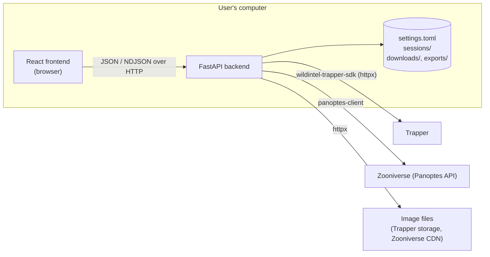
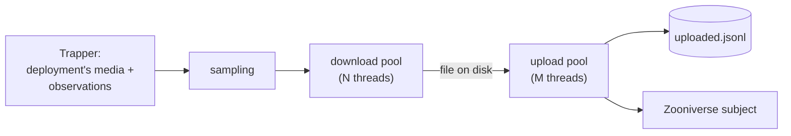

# WildINTEL Zooniverse — Developer Manual

---

## Table of Contents

1. [Architecture](#1-architecture)
2. [Development setup](#2-development-setup)
3. [Repository layout](#3-repository-layout)
4. [Backend](#4-backend)
5. [Frontend](#5-frontend)
6. [API reference](#6-api-reference)
7. [Adding a Zooniverse workflow](#7-adding-a-zooniverse-workflow)
8. [Testing](#8-testing)
9. [Building executables](#9-building-executables)
10. [Documentation](#10-documentation)
11. [CI/CD and releases](#11-cicd-and-releases)

---

## 1. Architecture

One Python package, `wildintel_zooniverse`, with a **core** and two faces on top of it:

- **web** — a **FastAPI** backend serving a **React** frontend, both on the user's own computer;
- **cli** — the `wildintel-zooniverse` command (**Typer** + rich): wildintel-tools' `zooniverse`
  commands.

The core's services do the work and know nothing of either: long operations return **generators
of event dicts**, which the web routers stream to the browser as NDJSON and the command line
renders as progress bars. Both use the same `settings.toml`, sessions and log. Released as a
single executable (PyInstaller) that runs the web app — starting the server and opening the
browser — or, given any argument, the command line.



(The command line takes the backend's place in the diagram: it calls the same services
directly, in the same process, without HTTP.)

- **No server-side login session.** Every request carries the credentials it needs; blank ones
  fall back to the saved ones in `settings.toml`. Passwords never go back to the browser.
- **Long operations stream.** Previews, uploads, downloads, validations, metadata updates and
  exports answer with `application/x-ndjson`: one JSON event per line, as the work progresses,
  ending with `{"type": "done", …}` — or `{"type": "error", "detail": …}` if it fails midway (the
  HTTP 200 is already sent by then). Errors found before starting — bad credentials, a missing
  session, a folder that can't be created — are plain HTTP errors instead. The request going
  away (the user pressing **Stop**, or closing the tab) stops the work.
- **Wizard sessions are persisted** as JSON manifests on disk (see
  [Sessions](#sessions)), so an upload can be resumed after closing the app.

Stack: Python ≥ 3.12, FastAPI, pydantic 2, Dynaconf, tenacity, panoptes-client,
[wildintel-trapper-sdk](https://github.com/wildintelproject/wildintelproject-trapper-sdk);
React 19, TypeScript, Vite, Tailwind CSS 4, Vitest, oxlint.

## 2. Development setup

Requirements: [uv](https://docs.astral.sh/uv/), Node.js ≥ 18 (20 in CI), git.

The Trapper SDK is used from a **sibling clone** while both are developed together
(`pyproject.toml`'s `[tool.uv.sources]`), so clone both side by side:

```bash
git clone https://github.com/wildintelproject/wildintel-zooniverse
cd wildintel-zooniverse
./setup.sh                                # see below
uv run wzcli dev                           # backend :8768 + frontend :5175, hot reload
```

`setup.sh` checks git, installs uv if it's missing, clones the SDK next to the project
(`../wildintel-trapper-sdk`, branch `development`) if it isn't there, and installs the backend's
(`uv sync`) and the frontend's (`npm install`) dependencies — skipping the frontend, with a
warning, without Node.js 18+. It can be run again at any time.

Open <http://localhost:5175>. The backend's own OpenAPI docs are at
<http://localhost:8768/docs>. In dev mode, edits in the SDK clone reload the backend too.

`uv run wildintel-zooniverse …` runs the user's command line — see the
[command-line manual](user-manual-cli.md). `wzcli` (`src/wildintel_zooniverse/wzcli.py`) is the
development one:

| Command | What it does |
|---|---|
| `uv run wzcli dev` | Backend and frontend together, hot reload. |
| `uv run wzcli backend serve [dev\|prod\|debug] [-p PORT]` | The backend alone. `debug` waits for a debugger (debugpy) on port 5678. |
| `uv run wzcli backend test [-v] [-k …]` | Backend tests (pytest). |
| `uv run wzcli frontend dev\|build\|preview\|test\|lint` | Frontend via npm (installing its dependencies first if needed). |
| `uv run wzcli docs serve\|build` | This documentation (`build` is strict, as in CI). |
| `uv run wzcli package build [-f FORMAT] [-v VERSION]` | This system's package into `dist/` — see [Building executables](#9-building-executables). |

!!! note "Why not `cli`"
    wildintel-trapper-sdk, installed in the same environment, already has a top-level `cli`
    module and `cli` command; a second one would shadow it — or be shadowed — depending on the
    install order. Hence `wzcli`.

The backend port is `WILDINTEL_ZOONIVERSE_WEB_PORT` (8768 — one above wildintel-publisher's,
so both run side by side); the log level `WILDINTEL_ZOONIVERSE_WEB_LOG_LEVEL`. Both can also go
in `src/wildintel_zooniverse/web/.env` or `~/.config/wildintel_zooniverse_web/.env` (see
`web/settings.py`).

!!! note "Two kinds of settings"
    `web/settings.py` is the **server's** (port, log level, CORS — environment variables).
    `core/config.py` is the **app's** own `settings.toml` (accounts, transfer tuning, defaults —
    the ⚙️ page, and `wildintel-zooniverse config`).

## 3. Repository layout

```text
wildintel-zooniverse/
├── src/wildintel_zooniverse/
│   ├── core/
│   │   ├── config.py            # the app's settings.toml (pydantic + Dynaconf)
│   │   ├── logging_setup.py     # the log file and console
│   │   ├── id_parsing.py        # id lists from text, CSVs and reports (the frontend's mediaIds.ts)
│   │   ├── version.py
│   │   ├── schemas/requests.py  # request/response models — also the CLI's selection model
│   │   └── services/            # the actual work (see below)
│   ├── web/
│   │   ├── main.py              # FastAPI app: routers + the built frontend as static files
│   │   ├── app_entry.py         # executable entry point: the web app — or, with arguments, the CLI
│   │   ├── settings.py          # the server's settings (env vars / .env)
│   │   └── api/routers/         # one router per area — thin: resolve credentials, map errors, stream
│   ├── cli/
│   │   ├── app.py               # the Typer app: config, sessions, lookups…
│   │   ├── commands_upload.py   # estimate-upload, analyze-sequences, import
│   │   ├── commands_zooniverse.py  # export, download_ss, update-metadata, check-*…
│   │   ├── common.py            # credentials, id options, the Trapper selection from ids, errors
│   │   └── render.py            # event streams → rich progress bars
│   └── wzcli.py                 # the development CLI (uv run wzcli …)
├── tests/unit/                  # pytest — Trapper and Zooniverse always faked
├── frontend/
│   └── src/
│       ├── api.ts               # every backend call, and the NDJSON stream reader
│       ├── types.ts             # the backend's models, in TypeScript
│       ├── pages/               # Wizard, Settings, Utils and each tool's page
│       ├── components/          # forms and panels shared by pages
│       └── test/                # Vitest setup and fixtures
├── docs/                        # this documentation (MkDocs Material)
├── .github/workflows/           # CI, docs, release
├── wildintel-zooniverse.spec    # PyInstaller
├── setup.sh                     # installs everything for development
├── mkdocs.yml
└── CHANGELOG.md
```

## 4. Backend

### Services

In `core/services/` — shared by the web routers and the command line.


| Module | Responsibility |
|---|---|
| `trapper_service` | Trapper navigation (projects → collection → deployments) and per-deployment fetches: media for sampling (`selections_stream`), media names for metadata (`media_index_stream`), observation ids for exports (`observation_index_stream`). Always one deployment at a time: a big collection times out in one request, and several at once make Trapper answer 500. |
| `sampling` | The image selection — candidates, sequences, middle-sequence filter, sampling. Pure functions. |
| `zooniverse_service` | Everything panoptes-client: login, projects, subject sets, subjects, workflows, exports, creating/updating subjects. |
| `upload_service` | The upload pipeline (dry run and real) — see below. |
| `session_store` | Wizard sessions on disk. |
| `retry` | `RetryPolicy` — tenacity with exponential backoff, cancellable. |
| `subject_download_service` | Download subject sets. |
| `validation_service` | Validation & audit. |
| `metadata_service` | Update metadata. |
| `classifications_export_service` | Retrieve classifications — the CSV. |
| `trapper_import_service` | Importing those CSVs into Trapper, through its API. |
| `id_lists` | `IdLists` — the whitelist/blacklist of media or subject ids (the blacklist wins). |
| `subjects_service` | The *Subjects* tool: lookup by id, and a subject set's pages. |
| `annotations/` | Per-workflow extractors and voters (see [section 7](#7-adding-a-zooniverse-workflow)). |

### panoptes-client and threads

panoptes-client keeps the *current* client **per thread** (`Panoptes._local` is a
`threading.local`), while FastAPI runs each sync request on any thread of its pool. So:

- `zooniverse_service._connected()` keeps one logged-in client per credentials, and makes it
  current for the calling thread (`with client:`) on every call.
- Worker pools (uploads, metadata updates) give **each thread its own client**
  (`new_client`), so no two threads refresh the same OAuth token at once.
- Lazy listings (`Subject.where(...)`) fetch later pages with `Panoptes.client()` — iterate them
  through `_iter_with(client, …)`, which makes the client current for each page.
- panoptes-client only saves attributes that were **assigned**: `subject.metadata = {...}`, never
  `subject.metadata[k] = v`.

### The upload pipeline

`upload_service.run_stream()`, deployment by deployment:



- A `Transfer` does the two steps: `ZooniverseTransfer` for real, `DryRunTransfer` simulated.
- `_Pipeline` runs downloads and uploads on pools of their own, bounded by a semaphore: at most
  N + M files on disk. Each image yields `step` events as each step starts, then one `image`
  event.
- Each step goes through `RetryPolicy.call()`; `download_retryable` / `upload_retryable` say
  which errors are worth retrying. Stopping sets a cancel event: retries waiting give up, no new
  attempt starts.
- Each uploaded image is appended to the session's `uploaded.jsonl` by its worker, right away;
  a new run skips those.

### Sessions

`session_store` keeps `Documents/wildintel-zooniverse/sessions/<task_id>/session.json`, merged
section by section as the wizard goes: `selected` → `filtered` → `destination` → `uploading` →
`done`. Only `done` means finished (its directory is removed on the next listing); anything
else is offered back on startup. Writes are atomic (`.tmp` + rename). No credentials, ever.

### Logging

`logging_setup` sets up a console handler and a rotating file handler
(`~/.config/wildintel-zooniverse/logs/wildintel-zooniverse.log`, 5 MB × 5) on the root logger,
at the level of **⚙️ → General** (`GENERAL.log_level` in `settings.toml`) — or of
`WILDINTEL_ZOONIVERSE_WEB_LOG_LEVEL`, which wins when set. Saving the settings calls
`apply_level()`: no restart needed.

- Every module logs to `logging.getLogger(__name__)`. **Info** for what the user started and how
  it ended (a run, its totals); **Debug** for each step (each image ↓/↑, each Trapper query, each
  subject); **Warning** for what failed but was handled — with
  `exc_info=logging_setup.debugging()`, so tracebacks appear at Debug only.
- The executable runs uvicorn with `log_config=None`, so its logs go through the same handlers;
  in development (`wzcli`) uvicorn keeps its own console output, and gets the file handler too.
- The access log hides `/api/health` (polled every 10 s) below Debug; `httpcore`, `urllib3`
  and similar stay at Info even at Debug.
- panoptes-client calls `logging.basicConfig()` on import; `configure()` removes that stray
  console handler so nothing is printed twice.

### Streaming endpoints

The pattern every NDJSON endpoint follows:

```python
events = service.run(...)              # checks up front — errors raise here → HTTP error
def lines():
    try:
        for event in events:
            yield json.dumps(event) + "\n"
    except Exception as exc:          # midway — the 200 is already sent
        yield json.dumps({"type": "error", "detail": ...}) + "\n"
    finally:
        events.close()                 # stops the work when the client goes away
return StreamingResponse(lines(), media_type="application/x-ndjson")
```

Services return a generator whose `finally` shuts its thread pools down.

## 5. Frontend

- `App.tsx` — the top bar, and which page shows: welcome, unfinished sessions, the wizard, or
  settings (shown over the rest, which stays mounted — nothing in progress is lost).
- `pages/WizardPage.tsx` — the upload wizard's steps. Its forms stay mounted (hidden) once
  shown, so **Back** keeps their state. *Retrieve classifications* and *Utils* open their own
  pages in place of the wizard.
- `api.ts` — every call. `streamNdjson()` reads an NDJSON response line by line, handing each
  event to a callback; resolves on `done`, rejects on `error`, and aborts with an
  `AbortSignal`.
- Progress panels reduce the stream's events into their state with a `reduce(run, event)`
  function — `UploadRunPanel`, `DownloadSubjectSetsPage`, `ValidationPage`, … follow the same
  shape.
- Shared pieces: `TrapperSelectionForm`, `UploadCriteriaForm`, `ZooniverseProjectPicker`,
  `ProgressBar`, `OptionCards`.

## 6. API reference

The full, live reference is FastAPI's own, at `/docs` while the backend runs. In short:

| Method | Path | What it does |
|---|---|---|
| GET | `/api/health`, `/api/version` | Health check; the running version. |
| GET, PUT | `/api/settings` | The ⚙️ settings (never passwords; a blank one keeps the saved one). |
| GET, DELETE | `/api/settings/log` | The current log file; deleting it (and its rotated copies) starts a new one. |
| GET | `/api/trapper/config` | Saved Trapper server and user. |
| POST | `/api/trapper/test-connection` | Checks — and saves — Trapper credentials. |
| POST | `/api/trapper/research-projects`, `…/classification-projects`, `…/collections`, `…/deployments` | Trapper navigation. |
| POST | `/api/trapper/upload-preview` | *NDJSON* — per-deployment counts of what the criteria keep. |
| GET | `/api/zooniverse/config` | Saved Zooniverse user. |
| POST | `/api/zooniverse/test-connection` | Checks — and saves — Zooniverse credentials. |
| POST | `/api/zooniverse/projects`, `…/subject-sets`, `…/workflows` | Zooniverse navigation. |
| POST | `/api/zooniverse/workflow-export` | A workflow's latest classifications export. |
| GET | `/api/sessions` | Unfinished sessions. |
| POST | `/api/sessions/selection`, `…/criteria`, `…/destination` | Saves a wizard step into its session. |
| DELETE | `/api/sessions/{task_id}` | Discards a session. |
| POST | `/api/upload/dry-run`, `/api/upload/start` | *NDJSON* — the upload, simulated or real. |
| POST | `/api/zooniverse/subjects/lookup`, `…/subjects/page` | The Subjects utility: subjects by id; a page of a subject set's. |
| GET | `/api/zooniverse/download-defaults` | The default downloads folder. |
| POST | `/api/zooniverse/download-subject-sets` | *NDJSON* — Download subject sets. |
| POST | `/api/validation/subject-set` | *NDJSON* — Validation & audit. |
| POST | `/api/metadata/update` | *NDJSON* — Update metadata (`dry_run` by default). |
| GET | `/api/export/defaults` | The export's default folder, "classified by" and CSV size. |
| POST | `/api/export/classifications` | *NDJSON* — Retrieve classifications (the CSV). |
| POST | `/api/export/import` | *NDJSON* — imports the CSVs into Trapper (the SDK's `import_classifications`). |

## 7. Adding a Zooniverse workflow

A workflow's classifications can only be exported with an **extractor** and a **voter** of its
own — its questions and species are its own. In `src/wildintel_zooniverse/core/services/annotations/`:

1. **Extractor** (`extractor.py`) — subclass `AnnotationsExtractor` and map every Zooniverse
   choice of the workflow to its Trapper name in `zoo_to_trapper`. `NOANIMAL` →
   `"blank"`, `HUMANORVEHICLE` → `"human"`, `OTHERSPECIES` → `"animal"`,
   `UNRECOGNIZABLE` → `"unknown"`; species → scientific names. Override `extract_matches` if
   its annotations aren't the usual survey-task shape.
2. **Voter** (`voter.py`) — usually reuse `Workflow29186AnnotationsVoter` or
   `Workflow29187AnnotationsVoter` (a subclass is enough); write one if it votes differently.
3. **Register** both in `registry.WORKFLOWS`, with a label.
4. **Test** it in `tests/unit/test_annotations.py` — a few typical classifications and
   the observations they must give.

Neither the frontend nor the command line needs a change: the workflow becomes *exportable* in
their lists.

## 8. Testing

```bash
uv run pytest                           # backend (or: uv run wzcli backend test)
cd frontend && npm test                 # frontend (Vitest)
cd frontend && npx tsc -b && npm run lint
```

- **Backend** — `tests/unit/`, FastAPI's `TestClient`. Trapper (`core.services.trapper_service._client`)
  and panoptes-client are **always faked**: no test touches the network. `conftest.py` points
  `HOME` and the config/documents folders at a temporary directory, so tests never touch a real
  `settings.toml` or sessions.
- **Command line** — `tests/unit/test_cli.py`, Typer's `CliRunner`, with the core's services
  patched: the commands must turn their options into the calls the web app makes.
- **Frontend** — each page/component has a `*.test.tsx` next to it; `api` is mocked with
  `vi.mock`, and streaming calls are driven by the test (`send()` an event, `finish()`).

## 9. Building executables

The frontend is built first, then PyInstaller bundles the package with it (as `static`), from
the spec every platform uses, `wildintel-zooniverse.spec` at the root:

```bash
cd frontend && npm ci && npm run build && cd ..
uv run pyinstaller wildintel-zooniverse.spec --distpath build/dist --workpath build/work               # one file (.exe, .dmg)
WZ_ONEDIR=1 uv run pyinstaller wildintel-zooniverse.spec --distpath build/dist --workpath build/work   # a folder (AppImage)
```

Its entry point, `web/app_entry.py`, starts the web app when run with no arguments and the
command line when run with any: one executable is both.

The version shown by the app comes from `src/wildintel_zooniverse/_version.py`
(`__version__ = "X.Y.Z"`), which the release workflow writes from the tag; without it, the
installed package's (`pyproject.toml`), else `dev`. It's not committed.

`uv run wzcli package build` does all of that for the current system — the frontend, the
executable with the version (`--version`, or the current git tag, or `0.0.0-dev`), and the
package — into `dist/`: an AppImage on Linux (needs
[appimagetool](https://github.com/AppImage/appimagetool/releases) on the `PATH`), the portable
`.exe` on Windows, the `.dmg` on macOS.

Each release builds three packages, each on its own system (PyInstaller doesn't
cross-compile):

| Package | Built on | From |
|---|---|---|
| `wildintel-zooniverse-X.Y.Z-linux-x86_64.AppImage` | Ubuntu 22.04 — runs on distributions with glibc 2.35 or newer | the folder build, packed with [appimagetool](https://github.com/AppImage/AppImageKit) |
| `wildintel-zooniverse-X.Y.Z-windows-x64.exe` | Windows | the one-file build, portable |
| `wildintel-zooniverse-X.Y.Z-macos-arm64.dmg` | macOS (Apple Silicon) | the one-file build, in a disk image |

None is signed: Windows SmartScreen and macOS Gatekeeper warn about them the first time.

## 10. Documentation

This site: MkDocs Material, in `docs/` (`mkdocs.yml`), versioned with
[mike](https://github.com/jimporter/mike).

```bash
uv run mkdocs serve          # http://127.0.0.1:8000, live reload
uv run mkdocs build --strict
```

`docs/changelog.md` includes `CHANGELOG.md`: keep release notes there only.

### Screenshots

The web manual's screenshots (`docs/img/screenshots/`) are generated, not taken by hand:

```bash
uv run wzcli docs screenshots                  # builds the frontend, then every screenshot
uv run wzcli docs screenshots export subjects  # only these
```

`tools/screenshots/capture.py` serves the built frontend and drives it with Playwright, through
the same steps a user takes. `tools/screenshots/mock_api.js` replaces `fetch` in the page with a
fake backend that uses sample data: no Trapper, no Zooniverse, no account. Streaming endpoints
send their events and can be held open (`hold: true`), so a screenshot shows a run midway.
Screenshots are 1100 px wide, in dark mode, with an `en-GB` locale. Long pages are cropped to the
part that matters (`save(…, top=, bottom=)`).

When the UI changes, run it again and review the images. When a new step or label breaks a
screenshot, it's reported as failed, and `_failed-NAME.png` shows where it stopped. Playwright
uses the system's Chrome or Chromium if it finds one, otherwise its own
(`uv run playwright install chromium`).

## 11. CI/CD and releases

The repository is <https://github.com/wildintelproject/wildintel-zooniverse>. For now it has a
single branch, **`development`**; the workflows already handle a `main` branch for when there is
one.

| Workflow | When | What |
|---|---|---|
| `ci.yml` | Pushes and pull requests to `development` (and `main`, once it exists) | Backend tests; frontend type check, lint, tests and build; docs build. |
| `docs.yml` | Docs changes on `development`/`main`, `v*` tags, by hand | Publishes this site to GitHub Pages with mike — see [Documentation versions](#documentation-versions). |
| `release.yml` | `v*` tags, pushes to `development`, by hand | Runs the tests, builds the packages — Linux AppImage (x86_64), Windows portable `.exe` (x64), macOS `.dmg` (Apple Silicon) — and publishes a GitHub release, or the rolling **dev** pre-release. |

!!! warning "The Trapper SDK in CI"
    `pyproject.toml` takes the SDK from `../wildintel-trapper-sdk`. Every workflow clones it
    there first, from GitHub, at the ref in the repository variable **`TRAPPER_SDK_REF`**
    (`development` if unset) — so whatever this app needs from the SDK must be **pushed**
    there. Once the SDK has a release with it, point `[tool.uv.sources]` at its tag instead
    and drop that step.

### Documentation versions

The site is versioned with mike; the selector in its header switches between versions:

| Version | Published from |
|---|---|
| `dev` | every docs change on `development` |
| `main` | every docs change on `main` |
| `X.Y.Z` | the tag `vX.Y.Z` — the newest one also aliased `latest` |

The root URL (<https://wildintelproject.github.io/wildintel-zooniverse/>, the app's **? Help**)
opens the default version: `latest` once there's a release, else `main`, else `dev` — so it never
404s, whichever branches exist.

### Making a release

1. Move the notes under **Upcoming release** in `CHANGELOG.md` to a new
   `### [X.Y.Z](…compare/vA.B.C...vX.Y.Z) - YYYY-MM-DD` section, and bump `version` in
   `pyproject.toml`.
2. Tag it — on `development`, the only branch for now; on `main` once there is one:
   `git tag vX.Y.Z && git push origin vX.Y.Z`.
3. `release.yml` builds everything and creates the release, its notes taken from that
   `CHANGELOG.md` section; `docs.yml` publishes the docs as `X.Y.Z`, aliased `latest` — the new
   default version.

Every push to `development` refreshes the **dev** pre-release (the `dev` tag is moved to it),
its notes being **Upcoming release**. Run `release.yml` by hand (*Run workflow*) to build a
dev release with a version of your choice.
