# WildINTEL Zooniverse — User Manual (web)

**WildINTEL Zooniverse** takes the WildINTEL project's camera-trap images from Trapper to
Zooniverse, and brings its volunteers' classifications back. It runs on your own computer: a
small server that opens the app in your web browser.

Prefer a terminal, or want to script it? The same app has a command line — see the
[command-line manual](user-manual-cli.md).

---

## Table of Contents

1. [Installation](#1-installation)
2. [Getting started](#2-getting-started)
3. [Settings](#3-settings)
4. [Uploading images to Zooniverse](#4-uploading-images-to-zooniverse)
5. [Retrieving classifications](#5-retrieving-classifications)
6. [Utilities](#6-utilities)
7. [Where the app keeps its files](#7-where-the-app-keeps-its-files)
8. [Troubleshooting](#8-troubleshooting)

---

## 1. Installation

Download the package for your system from the
[releases page](https://github.com/wildintelproject/wildintel-zooniverse/releases):

| System | Package | How to run it |
|---|---|---|
| Linux (x86_64) | `wildintel-zooniverse-X.Y.Z-linux-x86_64.AppImage` | `chmod +x` it and run it — no installation. Needs FUSE 2 (`libfuse2`), present on most distributions. |
| Windows (x64) | `wildintel-zooniverse-X.Y.Z-windows-x64.exe` | Portable: no installation, just run it. Windows SmartScreen may warn about it the first time (*More info → Run anyway*): the app isn't signed. |
| macOS (Apple Silicon) | `wildintel-zooniverse-X.Y.Z-macos-arm64.dmg` | Open it and copy `wildintel-zooniverse` out; run it from a terminal. The first time, macOS may ask you to allow it in *System Settings → Privacy & Security*: the app isn't signed. |

!!! note "Development builds"
    The release tagged **dev** is built from the latest development code — useful to try new
    features, not for production use.

When started, the app finds a free port (from 8768 up), prints its address in the terminal —
`Server on http://127.0.0.1:8768` — and opens it in your browser. Keep the terminal window
open while you use it: closing it stops the app.

Run with any argument (`--help`, `import …`), the same package is the
[command line](user-manual-cli.md) instead.

You need an account in the **Trapper** instance your images are in, and a **Zooniverse**
account that owns — or collaborates on — the Zooniverse project.

## 2. Getting started

The welcome page lists what the app does. Press **Get Started**.

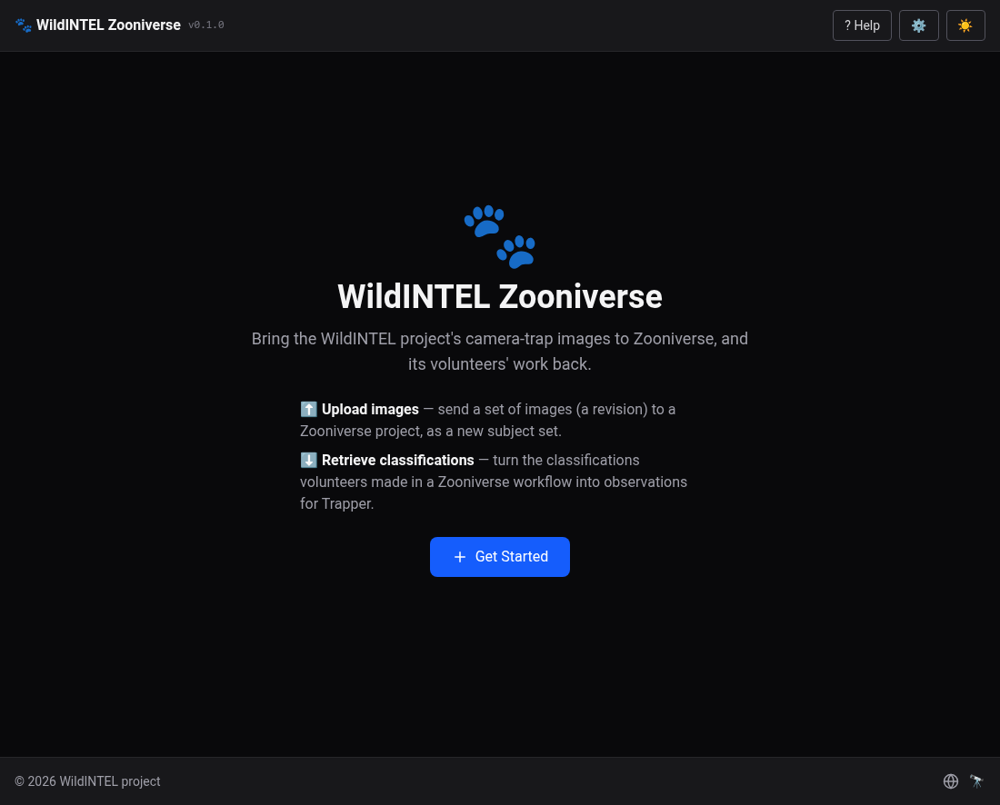{ loading=lazy }

If an earlier upload was left unfinished, the app first shows the **Unfinished runs** page: each
run with its research project, classification project, collection and deployments, and how far it
got. **Resume** it, **Discard** it, or **Start a new run instead**. (See
[Sessions](#sessions).)

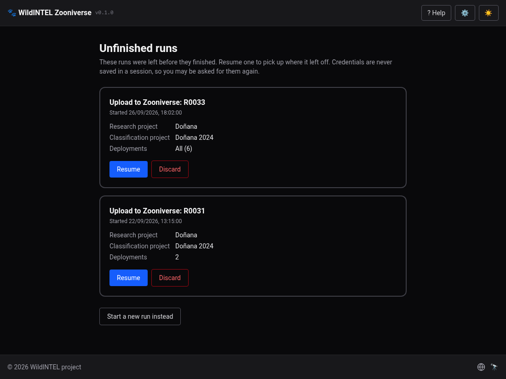{ loading=lazy }

The first step asks **What do you want to do?**:

- **Upload images to Zooniverse** — see [section 4](#4-uploading-images-to-zooniverse);
- **Retrieve classifications** — see [section 5](#5-retrieving-classifications);
- **🧰 Utils**, below both — see [section 6](#6-utilities).

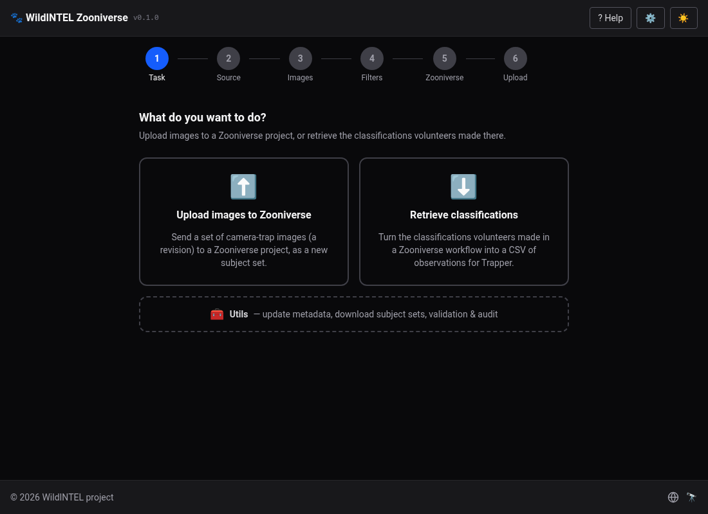{ loading=lazy }

The top bar has the app's name — click it to go back to the first page (it asks first if something
is under way; what was saved can be resumed from there) — **? Help** — this documentation, in a new
browser tab — the **⚙️ settings** button, and the light/dark mode switch.

## 3. Settings

The ⚙️ button opens the settings, one section at a time from the sidebar. **Save** saves every
section at once; a section with an invalid value is marked with a red dot. What you're doing
elsewhere in the app isn't lost while you're here: **Back** returns to it.

Changes apply to the next upload, dry run, download or export — not to one already running.

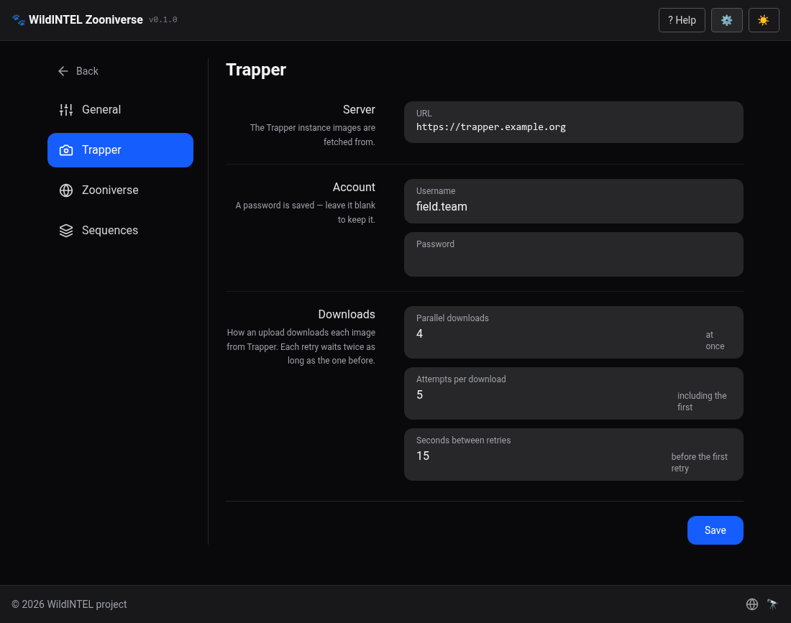{ loading=lazy }

### General

| Setting | What it is |
|---|---|
| Log level | How much the app writes to its log: **Error**, **Warning**, **Info** (the default) or **Debug** — everything: each image downloaded and uploaded, each Trapper and Zooniverse query, full error tracebacks. Applied as soon as it's saved. |
| Log file | Where the log is — see [below](#7-where-the-app-keeps-its-files). **Download log** saves a copy, to attach to a bug report; **Clear log** deletes it and its older copies, after confirming — logging goes on into a new one. |

### Trapper

| Setting | What it is |
|---|---|
| Server URL, username, password | The Trapper account. Also saved when a connection test succeeds anywhere in the app. A password is never shown: leave it blank to keep the saved one. |
| Parallel downloads | Images downloaded from Trapper at once during an upload (4). |
| Attempts per download | Including the first try (5). |
| Seconds between retries | Before the first retry — each next one waits twice as long (15). |

### Zooniverse

| Setting | What it is |
|---|---|
| Username, password | The Zooniverse account — as for Trapper. |
| Parallel uploads | Images uploaded to Zooniverse at once (4). Also used by Download subject sets and Update metadata. |
| Attempts per upload | Including the first try (5). |
| Seconds between retries | Before the first retry (30). |
| Folder | Where the exports are written — each in a folder of its own inside it. Blank: `exports` in the app's documents folder (see [section 7](#7-where-the-app-keeps-its-files)). |
| Classified by | Who exported classifications are classified by, in Trapper (`zooniverse@wildintel-project.org`). |
| Largest CSV | Classification exports bigger than this are split into several files (1.5 MB). |

### Sequences

The criteria a new upload starts from — see [Filters](#step-3-filters). Each upload can still
change its own.

## 4. Uploading images to Zooniverse

After choosing the task, the upload is a wizard of five steps, shown at the top: **Source → Images →
Filters → Zooniverse → Upload**. **Back** goes to the previous step without losing what you chose.

### Step 1 — Source

Where the images come from: a **Trapper Instance**. (*Local files* is coming soon.)

### Step 2 — Images

There is no connection step: the Trapper account saved in the [settings](#3-settings) is used. Every
dropdown can be typed in to narrow its options, and shows a spinner while they load.

1. **Research project**, **Classification project** and **Collection**.
2. **Deployments** — all of the collection's deployments with images in it, each with how many
   it has there. Keep **all**, or choose some (the filter box finds them by id or location).

**Next** saves the choice into a new session.

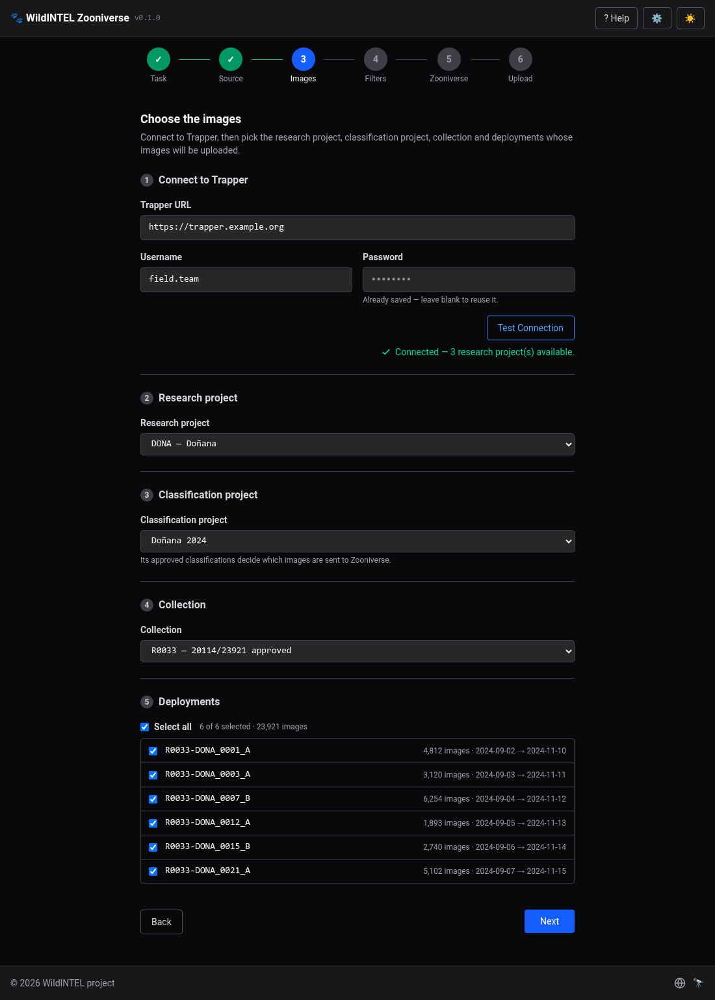{ loading=lazy }

### Step 3 — Filters

Which of those images are uploaded:

| Criterion | Default |
|---|---|
| **Max. gap within a sequence** — a longer gap between two consecutive images starts a new sequence | 90 s |
| **Images per sequence** — kept from each sequence, evenly spaced, first and last included | 5 |
| **Only classified images** — skip images with no observation, or only *unclassified* ones | on |
| **Remove humans from middle sequences** — a deployment's first and last sequences (setting up and collecting the camera) keep them | on |
| **Remove vehicles from middle sequences** — the same, for vehicles | off |

**Preview** counts, deployment by deployment, how many images each criterion keeps:

| Column | Meaning |
|---|---|
| Images | The deployment's images in the collection. |
| Candidates | Those that can be uploaded: public in Trapper, and classified if asked. |
| Sequences | How many sequences the candidates form. |
| Removed | Humans/vehicles removed from middle sequences. |
| Upload | What's finally uploaded. |

The preview asks Trapper one deployment at a time — a large collection takes a while. **Stop**
it whenever you've seen enough.

**Analyze sequences** does the same, and also keeps each deployment's sequences — wildintel-tools'
`analyze-sequences`, with exactly the criteria above:

- click a deployment to see its sequences: when each starts, how long it lasts, its images, how
  many were removed (humans/vehicles in a middle sequence) and how many are uploaded;
- click a sequence to see its images, each coloured by what becomes of it — **uploaded**, **not
  sampled** (the sequence has more images than are kept), **removed: human** or **removed:
  vehicle** — and linked to its preview in Trapper;
- **Download sequences (CSV)** saves them all: one row per sequence, with wildintel-tools' columns
  (`deploymentID`, `sequence_n`, `total_images`, `media_ids` — the uploaded ones —, `first_date`,
  `last_date`, `duration_s`) plus the ids of the images not uploaded, and why.

It asks Trapper the same as the preview; only the answer is bigger.

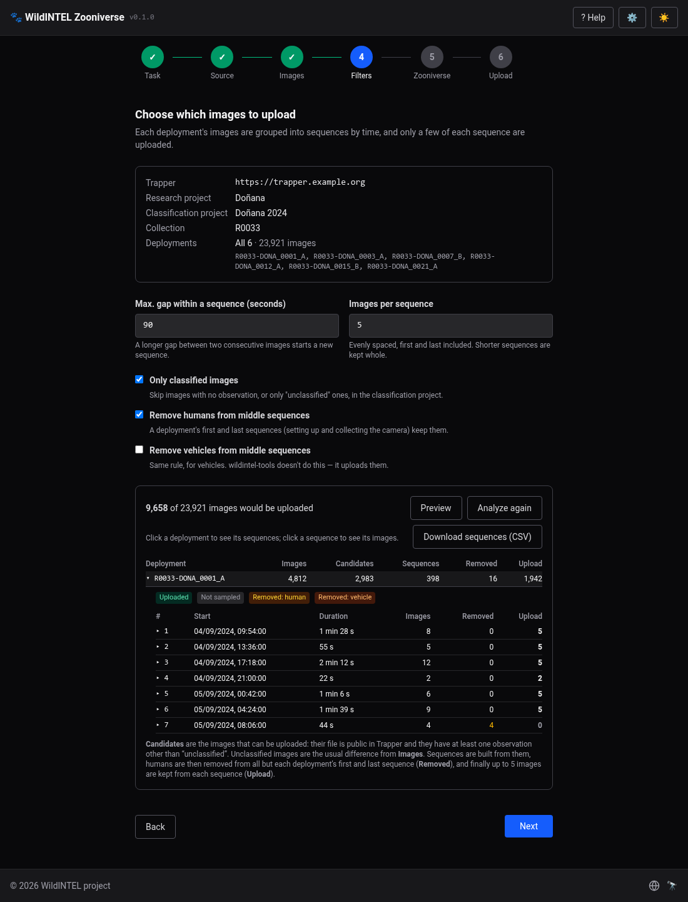{ loading=lazy }

### Step 4 — Zooniverse

There is no connection step: the Zooniverse account saved in the [settings](#3-settings) is used,
and your projects load by themselves (the dropdown can be typed in to narrow it).

1. **Zooniverse project** — only those you own or collaborate on.
2. **Subject set** — one of two:
   - **New subject set**: its **name**, by default wildintel-tools' own,
     `{research project}_{pk}_{collection}_{pk}_{YYYY-MM}`. If the project already has a subject
     set with that name, the images are **added to it** (it says so); otherwise it's created.
   - **Existing subject set**: search the project's subject sets by name or id — each with how
     many subjects it has — and pick one: the images are **added to it**.

!!! tip
    A new subject set must be linked to a workflow in the project's Lab for volunteers to
    classify it — the app doesn't do that.

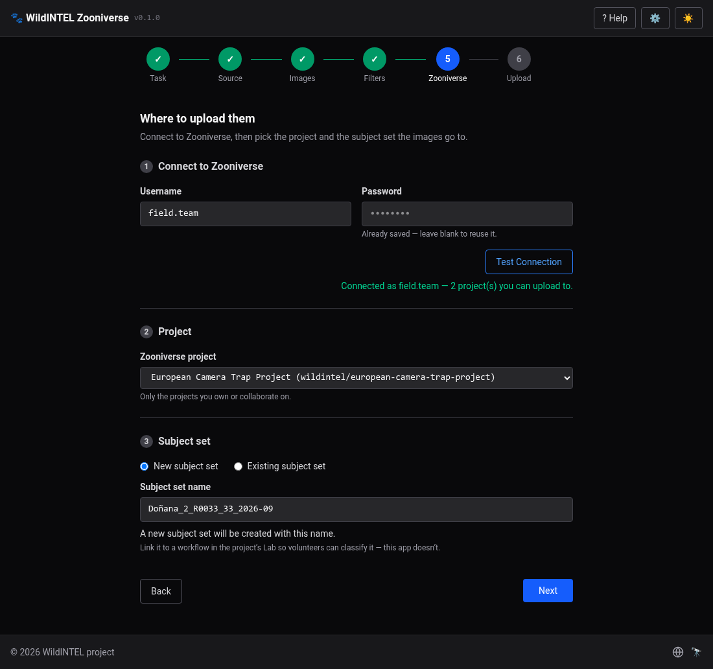{ loading=lazy }

### Step 5 — Upload

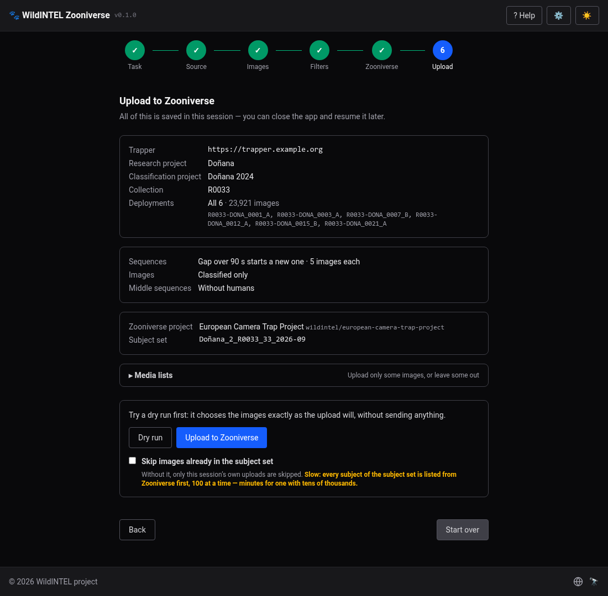{ loading=lazy }

A summary of everything chosen, and two buttons:

**Dry run** does everything the upload does but upload: the images are fetched from Trapper and
chosen exactly as they will be, and the subject set is looked up — but downloading and uploading
each image are only simulated (a second each, so you can see them go by). Nothing is written to
disk or to Zooniverse. Use it to check what an upload would do.

**Upload to Zooniverse** asks for confirmation, then uploads for real.

**Media lists** (above both) — to upload only some images, or leave some out, by their Trapper
media id — wildintel-tools' `--media` and `--exclude-media`:

- **Upload only some images** → **Only these images**: the images the filters keep but aren't
  listed are left out.
- **Never these images**: left out even if they're in the other list.

Type or paste the ids (one per line, or separated by commas or spaces), or **Load file…**: a list
of ids, a CSV with a media id column (such as *Download sequences*'), or a *Validation & audit*
report — its **missing** images, to upload just those. The lists apply after the filters, to the
dry run and the upload alike, and are kept in the session; the result says how many images they
left out.

**Skip images already in the subject set** (off by default) — the images this session uploaded
are always skipped; with this option, so are those already in the subject set whoever uploaded
them (wildintel-tools, another session…). Use it when adding to a subject set that has images of
the same collection already.

!!! warning "It's slow"
    To know what's in the subject set, every one of its subjects is listed from Zooniverse first —
    100 per request. For a subject set with tens of thousands of subjects that takes **minutes**,
    before anything is uploaded; its own progress bar shows it. It works for dry runs too.

Both show:

- **Total** — the whole run's progress.
- **One bar per deployment** — *Waiting*, *Fetching images from Trapper…*, then how many of its
  images are done; ✓ once finished (amber if some failed). Under each, the files being
  **↓ downloaded** from Trapper and **↑ uploaded** to Zooniverse at that moment.
- The **subject set** — whether it exists (the images are added to it) or is created.
- A table of **failures**, with the step that failed and why.

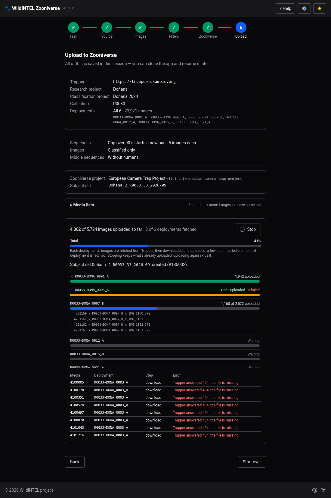{ loading=lazy }

Deployments are done one after another; within each, several images at once (see
[Settings](#zooniverse)). A failed step is retried a few times before the image counts as failed;
the rest go on.

!!! warning "Keep the page open"
    Closing the browser tab, reloading it or pressing **Stop** stops the upload. Nothing is lost:
    every image uploaded is recorded the moment it is, and **Upload again** skips them — it
    only uploads what's missing, including the images that failed.

#### Sessions

Every upload is a **session**, saved as you go: the images chosen, the filters, the destination
and each image uploaded. Close the app whenever you want: the next time it starts, it offers the
unfinished session back, and **Upload again** carries on where it stopped. A session is finished
— and removed — once every image is uploaded.

Sessions never keep passwords: resuming one asks you to connect again.

#### What each subject gets

Each image becomes a Zooniverse subject with these metadata, so it can always be traced back to
Trapper:

| Field | Value |
|---|---|
| `Filename`, `image_name` | `{media id}_x_{original file name}` |
| `external_id` | `{Trapper URL}/:media:{media id}` |
| `link`, `preview`, `thumbnail` | The image in Trapper: original, preview and thumbnail |
| `origin` | The Trapper instance |
| `license` | CC BY-NC 4.0 |

## 5. Retrieving classifications

Turns the classifications volunteers made in a Zooniverse **workflow** into a CSV of
observations, for Trapper's classification import.

It is a wizard of three steps, shown at the top: **Zooniverse → Trapper → Export**. **Back**
goes to the previous step without losing what you chose, and from the first one to the task
choice. It connects with the Zooniverse and Trapper accounts saved in the [settings](#3-settings):
there is nothing to fill in or test. Every dropdown can be typed in to narrow its options, and
shows a spinner while they load.

### Step 1 — Zooniverse

Choose the **project** and the **workflow**. Only workflows the app knows how to vote can be
chosen — each has its own species and questions (17553, 29186 and 29187). The app shows when the
workflow's latest **classifications export** was made (in UTC, marked *Available*) — the date of
its file, which can be used even if Zooniverse still says it's being made.

- It doesn't have the classifications made since: tick **Generate a new export** to have
  Zooniverse make a new one (it can take several minutes for a big workflow, sometimes hours).
  Zooniverse makes one export per workflow every 24 hours: until then the box is disabled.
- If a newer export was requested and hasn't finished, the latest file is used; one that never
  finished after 24 hours can be asked for again.
- If the workflow has no export yet, one is made first.

### Step 2 — Trapper

The **research project**, **classification project**, **collection** and **deployments** the
subjects were uploaded from: their observations get the classifications. Subjects of other images
(e.g. another subject set of the same workflow) are skipped. Each choice gets a tick once made.

### Step 3 — Export

A **summary** of what you chose, and the options: whether to **also save the volunteers' answers**
(a second CSV with every answer before voting — to see how an observation was decided) and whether
to **import into Trapper when finished**, and whether to **also keep Zooniverse's own classifications
CSV** as it was exported (it can be hundreds of MB; off by default). The folder, *Classified by* and the largest CSV size are
the [settings](#3-settings)'.

**Export CSV**, and follow its phases: the export, the classifications downloaded, the Trapper
deployments fetched, and the subjects voted.

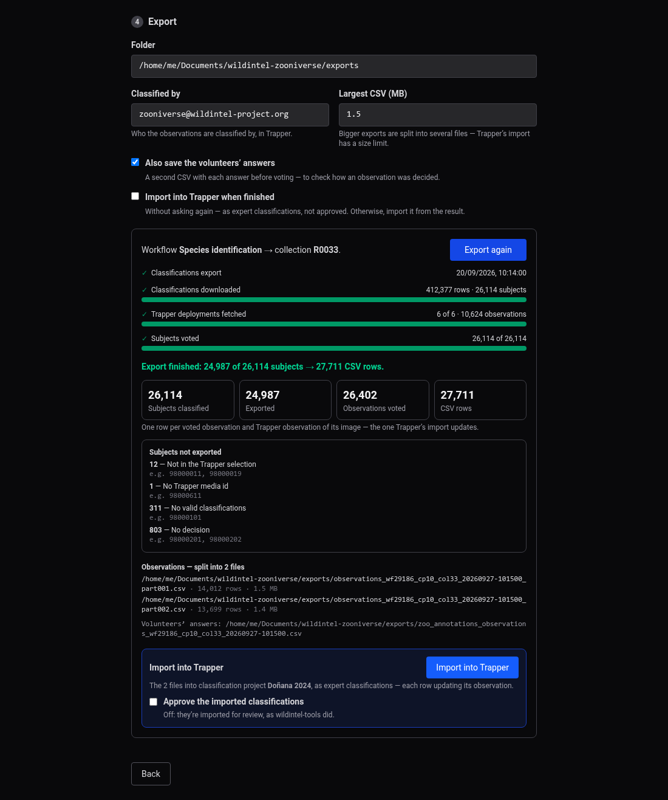{ loading=lazy }

The result shows how many subjects were exported, how many weren't and why (with examples),
and the files written — how many, their rows and size, with an **Open folder** button that opens
them in your file manager. Each export writes into a folder of its own inside the settings' export
folder, named after the workflow, the classification project, the collection and the time
(`wf29186_cp46_col45_20261010-011002`), with every file it makes:

| Why a subject isn't exported | Meaning |
|---|---|
| Not in the Trapper selection | Its image has no observation in the chosen collection and deployments. |
| No Trapper media id | Its metadata doesn't say which Trapper image it is. |
| No valid classifications | Every classification had no answer, or too many. |
| No decision | The votes didn't produce an observation. |

### Importing the CSV into Trapper

Next to **Open folder**, the result has an **Import into Trapper** button: it imports every file of
the export (a big one is split into `…_part001.csv`, `…_part002.csv`…) into the classification
project you chose, one after another, as **expert classifications** — each row updating its
observation. It asks for confirmation first, and there you can tick **Approve the imported
classifications** to approve them too; by default they aren't approved.

Each file shows whether Trapper took it. Trapper may import a file **in the background**: it then
answers with a task id, and the observations can take a while to show. A file Trapper refuses
(e.g. invalid rows) doesn't stop the rest — **Import again** retries.

To import right after the export, without asking, tick **Import into Trapper when finished** in
the export's options — wildintel-tools' `export --upload`.

If the import fails, the box links to Trapper's own import page, to do it by hand: upload each
file there, checking only **Import expert classifications**.

### How classifications are voted

For each subject, the volunteers' answers are extracted (a classification with no answer, or more
than 3 species, is discarded), and *k* — how many species most volunteers saw — decided. The *k*
most voted species become its observations, each with the median of the volunteers' counts. When
several species were seen, "no animal" answers don't count.

## 6. Utilities

**🧰 Utils**, on the first step, opens four tools. Each starts by connecting to Zooniverse and
choosing a project.

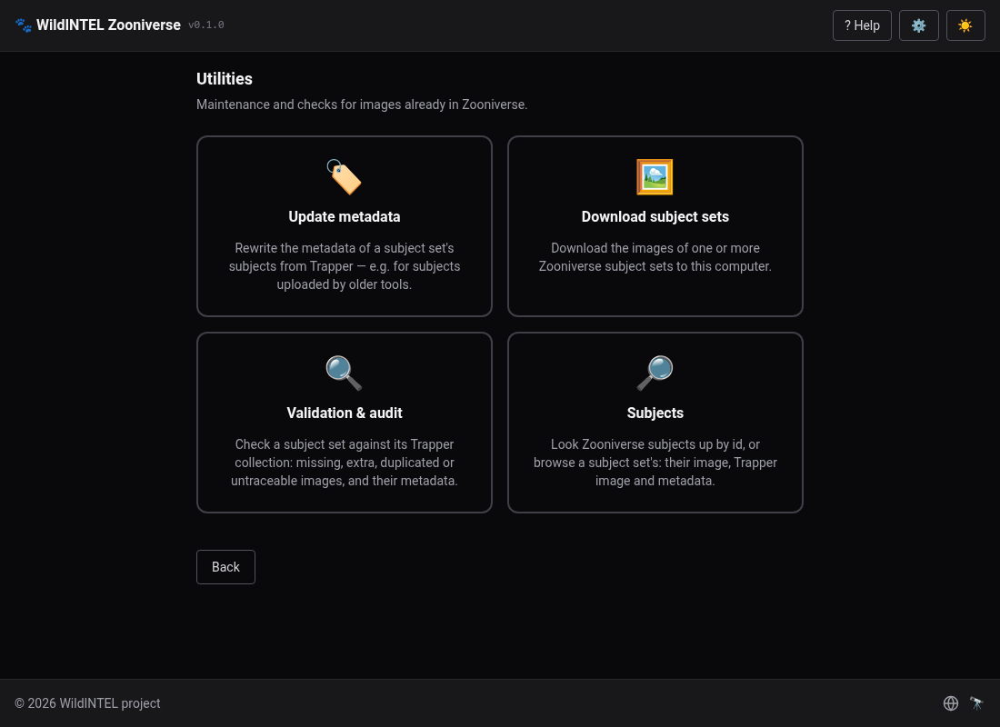{ loading=lazy }

### Download subject sets

Downloads the images of one or more subject sets to this computer.

1. Choose the **subject sets** (or **All subject sets**) — with how many images they add up to.
2. The **folder** — each subject set goes into a folder of its own inside it, `{id}_{name}`.
3. **Download again images already there** — otherwise they're skipped.
4. **Subject lists** (optional): only some subjects, or never some, by subject id — as the
   upload's media lists: typed, pasted or loaded from a file (a list, or a CSV with a `subject_id`
   column); *never these* wins when an id is in both.
5. **Download**.

Each image is named `{subject id}_{original file name}`. Stopping keeps what was downloaded, and
downloading again only fetches what's missing; an image being downloaded when stopped is never
left half-written.

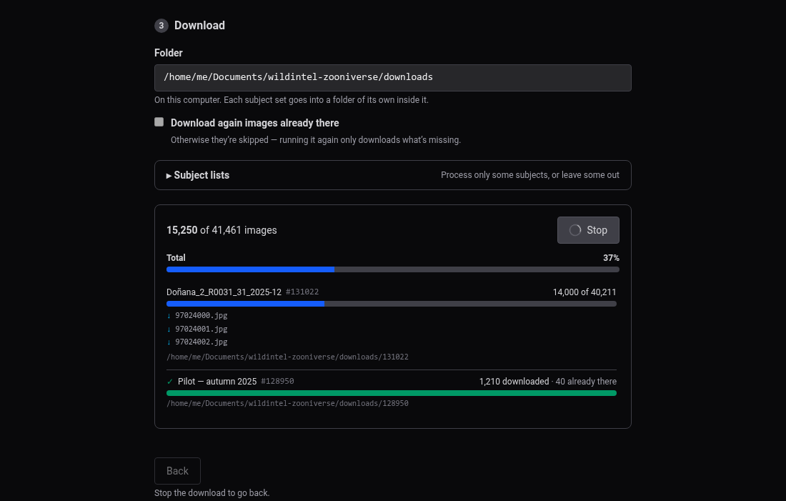{ loading=lazy }

### Validation & audit

Checks a subject set.

1. Choose the **subject set**.
2. **Compare with what an upload would send** (on by default): choose the Trapper collection and
   the criteria it was uploaded with. Otherwise only the subject set itself is checked.
3. **Validate**.

| Finding | Meaning |
|---|---|
| Missing | Images an upload would send that aren't in the subject set. *(compared)* |
| Extra | Images in the subject set an upload wouldn't send. *(compared)* |
| Duplicated | A Trapper image in more than one subject. |
| Unmatched | Subjects with no Trapper media id in their metadata. |
| Metadata issues | Required fields missing — and, compared, fields different from what an upload would set. |

With a comparison, a table shows each deployment's expected, uploaded and missing images. Each
finding opens to show its first 200 cases; **Download report (JSON)** saves them all — with the
list of every Trapper image in the subject set and its subjects. **Download uploaded media ids
(TXT)** saves just those ids, one per line: load it as an upload's *Never these images* not to
upload them again.

!!! tip
    Missing/extra images are only meaningful with the **same criteria** the subject set was
    uploaded with.

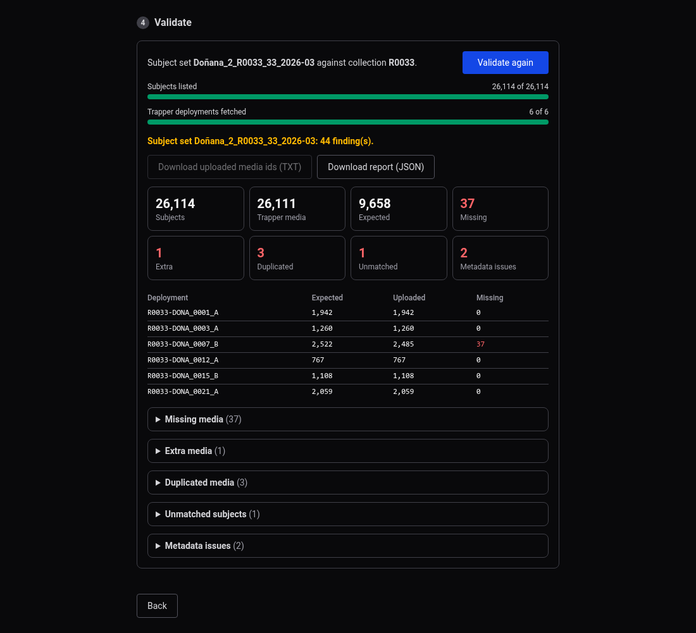{ loading=lazy }

### Update metadata

Rewrites a subject set's metadata from the Trapper collection it was uploaded from — e.g. for
subjects uploaded by older tools, with other file names or links. Only the fields that differ
change; the rest of each subject's metadata stays.

1. Choose the **subject set**, and the **Trapper images** it was uploaded from.
2. **Dry run** first: it checks every subject and shows what would change — each field's current
   value, crossed out, and its new one — without changing anything. **Download log (JSON)** saves
   it.
3. **Update metadata** — after confirming — makes the changes.

**Subject lists** (optional, above the buttons): only some subjects, or never some. Besides a list
or a CSV, they load a *Validation & audit* report — its subjects with metadata issues, to fix just
those — or this page's own log.

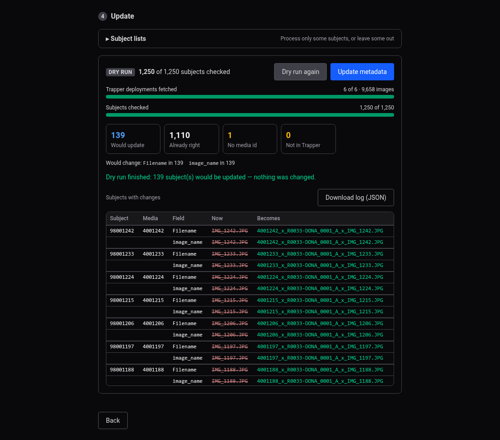{ loading=lazy }

| Result | Meaning |
|---|---|
| Would update / Updated | Its metadata differs from what an upload would set. |
| Already right | Nothing to change. |
| No media id | No Trapper media id in its metadata — left as it is. |
| Not in Trapper | Its image isn't in the Trapper selection — left as it is. |
| Failed | Couldn't be saved — update again to retry. |
| Left out | Left out by the subject lists. |

### Subjects

Shows Zooniverse subjects — wildintel-tools' `subjects`:

- **Browse a subject set**: choose the project and the subject set, and page through its subjects,
  50 at a time.
- **Look up subjects by id**: type or paste their ids, or load them from a file (a list, a CSV
  with a `subject_id` column, or a report of the app's). Those that don't exist — or you can't
  see — are listed apart.

Each subject shows its image (click it for the full one), the Trapper image it is — linked to it
in Trapper, when its metadata says —, the subject sets it's in, when it was created, and all its
metadata.

## 7. Where the app keeps its files

| What | Where (Linux; the equivalent folders on Windows and macOS) |
|---|---|
| Settings | `~/.config/wildintel-zooniverse/settings.toml` |
| Log | `~/.config/wildintel-zooniverse/logs/wildintel-zooniverse.log` (rotated at 5 MB, the last 5 kept) |
| Upload sessions | `~/Documents/wildintel-zooniverse/sessions/` |
| Downloaded subject sets | `~/Documents/wildintel-zooniverse/downloads/` (by default) |
| Classification exports | `~/Documents/wildintel-zooniverse/exports/` (by default) |

!!! warning
    `settings.toml` holds your Trapper and Zooniverse passwords, in plain text. Keep it private.

## 8. Troubleshooting

!!! tip "Reporting a problem"
    Set **⚙️ → General → Log level** to **Debug**, do again what went wrong, then **Download log**
    and attach it to the report — with what you did and what you expected. Set the level back to
    **Info** afterwards: Debug logs grow fast. Passwords are never written to the log.

**"Backend not reachable — is the server running?"** — the app's terminal window was closed, or
the app stopped. Start it again.

**"Incorrect Trapper/Zooniverse username or password."** — check them, and test the connection
again.

**The preview or an upload is slow to start.** — Trapper is asked one deployment at a time; a
deployment with hundreds of thousands of images takes a while.

**An upload stopped.** — Start the app again, resume the session, and **Upload again**: what was
already uploaded is skipped.

**Some images failed.** — The failures table says why. Network errors are retried already;
**Upload again** retries the failed images. A file missing in Trapper, or a Zooniverse quota
error, isn't retried.

**A workflow can't be exported.** — The app has no extractor/voter for it yet: its answers mean
nothing to the app. Ask a developer to add one (see the developer manual).

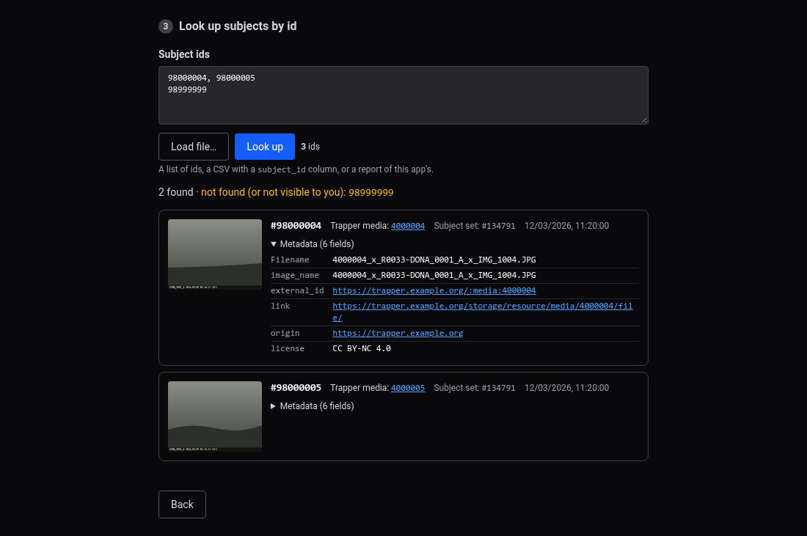{ loading=lazy }
